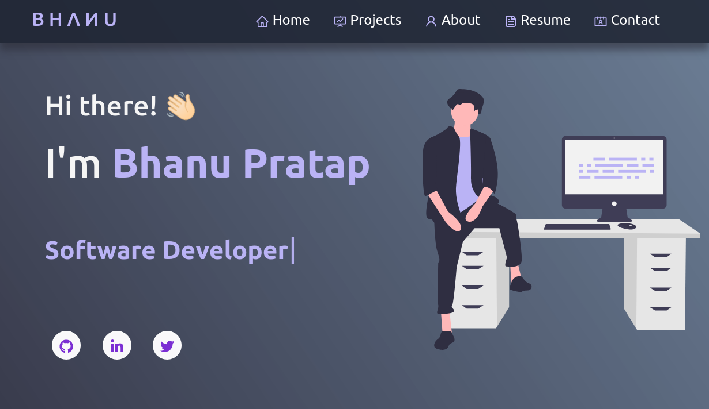

<h2 align="center">
  Personal Portfolio<br/>
  <a href="https://bhanupratap.me/" target="_blank">bhanupratap.me</a>
</h2>

<div align="center">
  
</div>

<br/>
<center>

[](https://forthebadge.com) &nbsp;
[](https://forthebadge.com) &nbsp;
[](https://forthebadge.com) &nbsp;
[](https://forthebadge.com)

</center>

<h3 align="center">
    🔹
    <a href="https://github.com/bhanups10/portfolio/issues">Report Bug</a> &nbsp; &nbsp;
    🔹
    <a href="https://github.com/bhanups10/portfolio/issues">Request Feature</a>
</h3>

## TL;DR

You are allowed to fork this repo and make changes for your own use.

Please don't forget to give me proper credit by linking back to [Bhanu Pratap](https://github.com/bhanups10/portfolio). Thanks!

If you like my work, show your support by giving a ⭐.

## Built With

I used following tools and technologies to build this portfolio project:

- React.js
- CSS3
- VsCode
- Git
- Netlify

## Features

**📖 Multi-Page Layout**

**📱 Fully Responsive**

## Getting Started

Fork this repository and clone down on your local machine. You will required `node.js` and `git` installed globally on your machine.

## 🛠 Installation and Setup Instructions

1. Install and use the correct version of Node using [NVM](https://github.com/nvm-sh/nvm)

   ```sh
   nvm install
   ```

2. Install dependencies

   ```sh
   npm install
   ```

3. Start the development server

   ```sh
   npm start
   ```

## 🚀 Building and Running for Production

1. Generate a full static production build

   ```sh
   npm run build
   ```

2. Preview the site as it will appear once deployed

   ```sh
   npm run serve
   ```

## Show your support

Give a ⭐ if you like this repository!
